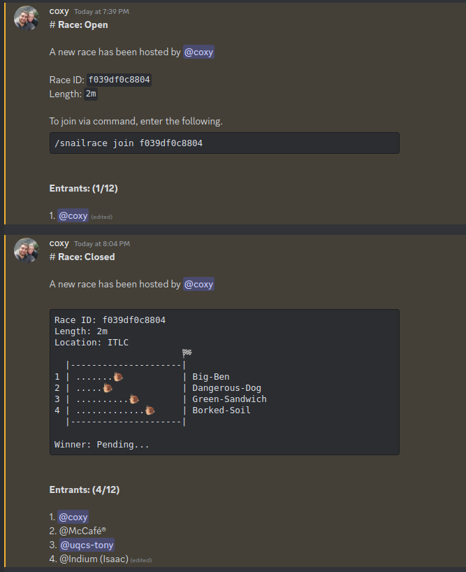

# Snailrace - Race
> 10th May 2023

The racing aspect of the game is and will always be the main gameplay feature of
the `snailrace` game. The premise of the racing mechanic is that someone will
host a race, someone will join the race then someone will win the race. I don't
want the racing to stray far from this basic system. Below is some concept 
design for how the race will look, this will be elaborated further in this 
document.



## Command

> `/snailrace host [ { flags } ]`

The command above is the simple initiator to start/host a race. There are a
couple of optional arguments that can be set to customise the race.

- `flags`: This is a list of options/strings that act as booleans for the 
           command. By default, none of these are active. The possible values 
           are:

    - `dont-fill` To not automatically fill the race with enough racers.
    - `no-bets` Skips the betting stage.
    - `only-one` If there was a draw, race the draw racers again until one wins.

> **Note:** Some snails are better at shorter races than longer ones, this can
>           be used for your benefit as the host with your select snail.


## Stages

The race will esentially run as a linear state machine. There are 4 states:

1. Race Open
2. Bets Open
3. Race Closed
4. Completed

Visually in discord, all the stages and graphics for the race will happen in the
same message which was the response for the host's interaction. This will 
require holding reference of the interaction response to edit. This is designed
to prevent a high volume of message spam.

### Race Open

> **Max Entrants:** 12

After runing the `/snailrace race ...` command, this will be the starting stage
and allow other members can join via the `/snailrace join <race_id>` command. 
There are some validations that need to be done in this step: The user must not 
already be in the race (regardless of snail).

The `Race Open` stage will vary in length being open for 10 seconds **after** 
the last entrant joined. ***This doesn't included failed join attempts***, which
could cause the `Race Open` stage to be open forever depending on how chaotic
the users are.

If the `dont-fill` flag **hasn't** been set. Then if there isn't a **minimum**
of **4 racers**, random users from the discord will be added to the race to fill
the space.

> **Important:** There is no minimum entrants. Which is 1 person (the host).

### Bets Open

> `no-bets` skips this stage

The bets stage will be open for a total of **30 seconds** and is open for 
everyone to make bets. A user can make multiple bets on the same or different
snails, as it will deduct money from them anyway. 

This stage must show the calculated `odds` for each snail in the race. The 
betted money will be multiplied by the odds if that snail wins. The odds are 
calculated using the following python code:

```py
def GenerateSnailOdd(snail_index: int, snails: set[SnailraceSnail]) -> float:
    # Sanity check
    if snail_index < 0 or snail_index >= len(snails):
        return 0.0
    
    # Get the snail
    snail = snails[snail_index]

    # Pre-calculate values
    sp_norm = snail.speed / sum([snail.speed for snail in snails])
    st_norm = snail.stamina / sum([snail.stamina for snail in snails])

    win_rate = 1
    if snail.wins != 0:
        win_rate = 1.0 - (snail.wins / snail.races)
        if win_rate == 0:
            return 10.0 * (1 - (sp_norm + st_norm)) 

    # Calculate odds
    return 10.0 * win_rate * (1 - (sp_norm + st_norm))
```

### Race Closed

This is the racing stage. No one can enter, no more bets can be made, it's just
pure snail racing. The race is just a loop that runs every second and calculates
the snails next steps before re-rendering the message with the new positions. 
The steps for each snail on each loop is calculated using the following:

```py
def step(self):
        # Generate Random Bias
        bias = generateMoodBias(self.mood)

        # Calculate base interval before bias and acceleration
        max_step = 10 + self.speed
        min_step = min(self.stamina, max_step - 5)
        avg_step = float(max_step + min_step) / 2.0

        # Calculate acceleration factor with weight and prevStep
        acceleration = float(self.weight - 5) / 5.0 + float(self._last_step - avg_step) / 5.0
        min_step = max(
            min_step + (-1 if self.weight < 5 else 1) * acceleration + bias, 0
        )
        max_step = min(
            max_step + (1 if self.weight < 5 else -1) * acceleration + bias, 20
        )

        # Calculate new position
        self._last_step = random.uniform(min_step, max_step)
        self._position = min(self._positionposition + self._last_step, 100)
```

### Completed

Once the race has completed, winner is displayed as well as the winnings of the
users who betted right. These users will also have their money updated in the 
database. 

All racers will receive a base `5xp` regardless of wining or not. The racer/s 
that win first place will receive `20xp` and `10g * distance`.

If the `only-one` flag has been set and there was a draw, a new race will 
commence **without** betting or entrances. The racers will be of all the racers
that drew (not including the 2nd place and lower). This will repeat a **MAX 5**
times until stopping and accepting that there will be a draw. The people who
bet any of the draws will get their respected money and the racers will get 
equal reward. The completed card will also have the sarcastic response of 
`I give up!`.

If the `dont-fill` flag has been set and the host is the only racer then the 
completed card will display a sarcastic message like the following:

- `@lcox74 has won! But it was against themselves, that was a little sad`
- `@JimmyD has won! Suspicious there was no other snails though`
- `@Andrew has won! But wait, it was a false start`

All money from people who made bets goes back to them as the race didn't have
enough people to warrant a reward. The racer will also not get a reward for the 
same reason.

### Race Win Messages

| Condition        | Number of snails | Number of wins |
| ---------------- | ---------------- | -------------- |
| Normal Win       | 4+               | 1              |
| Normal Tie       | 4+               | 2              |
| Normal 3 Way     | 4+               | 3              |
| Normal Super Tie | 4+               | 4+             |
| Duel Win         | 2                | 1              |
| Duel Tie         | 2                | 2              |
| Single           | 1                | 1              |


Race messages should be generated using a function that has the context of all
snails including the winning snails. An example can be as follows:

```py
def generate_win_message(winners: set[int], snails: set[Snail]) -> str:
    """
    From a set of winners and racers, randomly generate a response string to
    announce.
    """
    num_snails = len(snails)
    num_winners = len(winners)

    # Error Handle
    if num_snails == 0 or num_winners == 0:
        return "Hmmm... Something is wrong here"

    ## Check Conditions
    ...
    
```

**Normal Win**

- "We have a clear winner! `{snail name} (@{owner})` leaves the competition behind and races to victory!"
- "In an astonishing performance, `{snail name} (@{owner})` outpaces all the other snails and claims the first-place trophy!"
- "Congratulations to `{snail name} (@{owner})` for a stunning display of snail athleticism! The victory is well-deserved!"
- "And the winner is... drumroll... `{snail name} (@{owner})`! Snailtastic job!"
- "In a thrilling finish, `{snail name} (@{owner})` crosses the finish line first! Slow and steady wins the race!"`
- "Hooray! `{snail name} (@{owner})` leaves the competition in the dust and emerges victorious!"
- "The crowd goes wild as `{snail name} (@{owner})` emerges as the champion, leaving the competition in their slimy wake!"
- "A resounding victory for `{snail name} (@{owner})`! Their speed may be a mystery, but their determination is unmatched!"
- "In a stunning display of snail prowess, `{snail name} (@{owner})` claims the top spot. What a race!"
- "With lightning-fast speed (relatively speaking), `{snail name} (@{owner})` zips across the finish line, claiming the win!"

**Normal Tie**

- "We have a nail-biting tie! It's a shared victory between `{snail name} (@{owner})` and `{snail name} (@{owner})`! Snails in sync!"
- "Unbelievable! `{snail name} (@{owner})` and `{snail name} (@{owner})` cross the finish line simultaneously! It's a snail photo finish!"
- "What are the odds? We have a tie between `{snail name} (@{owner})` and `{snail name} (@{owner})`! These snails are true competitors!"
- "It's an incredible tie! `{snail name} (@{owner})` and `{snail name} (@{owner})` finish the race together, sharing the glory!"
- "The finish line witnesses a rare moment as `{snail name} (@{owner})` and `{snail name} (@{owner})` cross it simultaneously! We have dual champions!"
- "No one saw that coming! `{snail name} (@{owner})` and `{snail name} (@{owner})` match each other step for step and achieve a remarkable tie!"
- "We have a sensational tie! `{snail name} (@{owner})` and `{snail name} (@{owner})` share the glory in this nail-biting finish!"
- "It's a deadlock! `{snail name} (@{owner})` and `{snail name} (@{owner})` cross the finish line simultaneously, leaving us in awe!"
- "Wow, what a photo finish! `{snail name} (@{owner})` and `{snail name} (@{owner})` can't be separated. It's a tie!"
- "Two snails, one glorious finish! `{snail name} (@{owner})` and `{snail name} (@{owner})` prove that sharing is caring!"
  
**Normal 3 Way**

- "It's a miraculous three-way tie! `{snail name} (@{owner})`, `{snail name} (@{owner})`, and `{snail name} (@{owner})` all cross the finish line together, leaving us in awe!"
- "Hold on to your shells! In an astonishing turn of events, `{snail name} (@{owner})`, `{snail name} (@{owner})`, and `{snail name} (@{owner})` finish in perfect harmony. It's a remarkable three-way tie!"
- "In a display of snail synchronicity, `{snail name} (@{owner})`, `{snail name} (@{owner})`, and `{snail name} (@{owner})` cross the finish line simultaneously. It's a three-way tie for the ages!"
- "It's a snail miracle! `{snail name} (@{owner})`, `{snail name} (@{owner})`, and `{snail name} (@{owner})` defy the odds and create a breathtaking three-way tie!"
- "Three snails, one finish line, and an unforgettable result! `{snail name} (@{owner})`, `{snail name} (@{owner})`, and `{snail name} (@{owner})` share the glory in an epic three-way tie!"
- "In a stunning twist of fate, `{snail name} (@{owner})`, `{snail name} (@{owner})`, and `{snail name} (@{owner})` demonstrate their snail prowess by finishing together. It's a three-way tie for the record books!"
- "The race gods must be smiling upon us! `{snail name} (@{owner})`, `{snail name} (@{owner})`, and `{snail name} (@{owner})` astound us with their snail racing perfection. It's a spectacular three-way tie!"
- "Three snails, three champions! `{snail name} (@{owner})`, `{snail name} (@{owner})`, and `{snail name} (@{owner})` refuse to be outdone, resulting in an exhilarating three-way tie!"
- "Witness the magic of snail racing as `{snail name} (@{owner})`, `{snail name} (@{owner})`, and `{snail name} (@{owner})` reach the finish line simultaneously. It's a sensational three-way tie!"
- "It's a snail extravaganza! `{snail name} (@{owner})`, `{snail name} (@{owner})`, and `{snail name} (@{owner})` bring the crowd to their feet with a magnificent three-way tie!"

**Normal Super Tie**

- "We don't understand how this happened... but `{snail name} (@{owner})`, `{snail name} (@{owner})`... have drawn!"
- "In an unprecedented result, `{snail name} (@{owner})`, `{snail name} (@{owner})`... have all drawn!"
- "WHAT IS THIS MADNESS? `{snail name} (@{owner})`, `{snail name} (@{owner})` ... WHAT DID YOU DO!! "
- "Much like life, there are no real winners here. But congrats anyway `{snail name} (@{owner})`, `{snail name} (@{owner})` ..."
- "I'm not exactly sure how to handle this, but `{snail name} (@{owner})`, `{snail name} (@{owner})` ... have all won"
- "If you aren't happy with the result, be the change you want to be. But anyway, well done `{snail name} (@{owner})`, `{snail name} (@{owner})` ..."
- "Unbelievable! We have a historic tie between `{snail name} (@{owner})`, `{snail name} (@{owner})` ..."
- "A party of snails have crossed the line! `{snail name} (@{owner})`, `{snail name} (@{owner})` ..."
- "Hold your breath! There's perfect synchronisation between `{snail name} (@{owner})`, `{snail name} (@{owner})` ..."
- "We have a snail traffic jam! `{snail name} (@{owner})`, `{snail name} (@{owner})` ... have all crossed the line, resulting in a thrilling tie!"

**Duel Win**

- "It's a nail-biting duel, but `{snail name} (@{owner})` outmaneuvers `{snail name} (@{owner})` and secures a decisive victory! The snail supremacy is established!"
- "In a fierce showdown, `{snail name} (@{owner})` proves its mettle and triumphs over its rival `{snail name} (@{owner})`! Victory is sweet for this determined snail!"
- "With incredible speed and precision, `{snail name} (@{owner})` overtakes  `{snail name} (@{owner})`, leaving no doubt about who the true champion is!"
- "In a battle of wills and sluggishness, `{snail name} (@{owner})` outpaces `{snail name} (@{owner})` to seize the win!"
- "It's a duel for the ages, and `{snail name} (@{owner})` emerges as the snail champion, defeating `{snail name} (@{owner})` with style!"
- "In a race filled with anticipation, `{snail name} (@{owner})` emerges victorious, leaving `{snail name} (@{owner})` in their slimy wake!"
- "With shells clashing and slime flying, `{snail name} (@{owner})` outmaneuvers `{snail name} (@{owner})` to claim the victory!"
- "In an intense snail showdown, `{snail name} (@{owner})` emerges triumphant, leaving `{snail name} (@{owner})` in disbelief!"
- "It's a fierce duel, but `{snail name} (@{owner})` snails their way to victory, leaving `{snail name} (@{owner})` in their slimy wake!"
- "`{snail name} (@{owner})` proves their racing mettle by triumphing over `{snail name} (@{owner})` in a thrilling head-to-head race!"

**Duel Tie**

- "A stunning twist of fate! `{snail name} (@{owner})` and `{snail name} (@{owner})` match each other stride for stride and conclude the race in a perfect tie!"
- "In an extraordinary display of skill, `{snail name} (@{owner})` and `{snail name} (@{owner})` finish the race together, unable to be separated! A dual triumph!"
- "In a showdown for the ages, `{snail name} (@{owner})` and `{snail name} (@{owner})` refuse to let the other take the glory. It's an incredible tie in their one-on-one race!"
- "It's a snail stalemate! `{snail name} (@{owner})` and `{snail name} (@{owner})` cross the finish line together in a thrilling duel. It's a tie!"
- "Hold your slime! `{snail name} (@{owner})` and `{snail name} (@{owner})` refuse to back down, resulting in a breathtaking tie in their duel!"
- "Two snails enter, two snails tie! `{snail name} (@{owner})` and `{snail name} (@{owner})` prove to be equally matched in this extraordinary race!"
- "In a surprising turn of events, `{snail name} (@{owner})` and `{snail name} (@{owner})` can't be separated. It's a thrilling tie in their one-on-one race!"
- "Two snails, one finish line, and a nail-biting result! `{snail name} (@{owner})` and `{snail name} (@{owner})` tie in an unforgettable duel!"
- "It's a snail standoff! `{snail name} (@{owner})` and `{snail name} (@{owner})` can't be separated. It's a glorious tie!"
- "In an extraordinary display of snail talent, `{snail name} (@{owner})` and `{snail name} (@{owner})` tie in an epic race!"


**Single**

- "In a race with only one contender, `{snail name} (@{owner})` emerges as the undefeated champion! A magnificent solo performance!"
- "With no competitors to challenge it, `{snail name} (@{owner})` races ahead to claim a flawless victory! A legendary snail achievement!"
- "`{snail name} (@{owner})` wins by default in a race with no opponents! Sometimes, being the only snail has its advantages!"
- "In a surprising turn of events, `{snail name} (@{owner})` wins the race uncontested. A true snail legend!"
- "`{snail name} (@{owner})` shows up to an empty track but still manages to win. Now that's what we call snail power!"
- "It's a one-snail show! `{snail name} (@{owner})` sprints to the finish line without any opponents in sight!"
- "Unchallenged and unbeatable, `{snail name} (@{owner})` conquers the race without breaking a slimy sweat!"
- "No competitors? No problem! `{snail name} (@{owner})` crosses the finish line alone, securing a solo victory!"
- "`{snail name} (@{owner})` claims an uncontested victory! They were the only snail on the track, but they still rocked it!"
- "In a race against... well, no one, `{snail name} (@{owner})` emerges as the sole champion!"