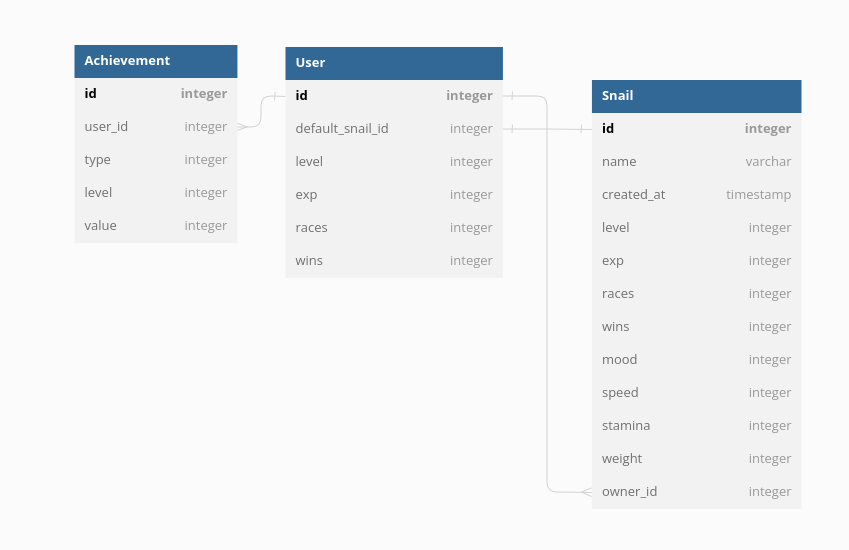

# Snail Race v2.0
> 4th May 2023

Welcome to the thrilling world of snail racing! The UQCS Discord bot brings you 
an exhilarating game where you can race snails in races. But it's not just about 
winning races - you can buy, sell, and trade snails with different stats, breed 
them together to create the ultimate snail, and earn achievements and badges 
that will set you apart from the rest.

Each user has their own profile that displays their wins, virtual snail money, 
snail count, user level and experience, and recent achievements. But it's the 
snails themselves that steal the show. Each snail is its own entity with unique 
stats, personality, and history. Their owners are tracked and their number of 
wins and win rate are proudly displayed. The ranking system ensures that the 
best of the best are recognized, and even the snail's mood can be a factor in 
their performance.

With a range of general, trading, racing, and breeding commands at your 
disposal, you'll have everything you need to master the world of snail racing. 
So what are you waiting for? Get ready to feel the rush of the race and the 
thrill of creating the ultimate snail in snailrace.

**Core Features:**

- *Race* snails in races 
- *Buy*, *sell* and *trade* snails with different stats
- *Breed* snails together to create better snails
- Earn *achievements* and *badges*

## Spec + Documentation

For further detail, please read the following documents.

- [Achievements](./docs/achievements.md)
- [Race Spec](./docs/race.md)

## User Profiles

Your user profile in snailrace is your gateway to snail racing glory. Your 
profile card displays your number of wins, win rate, virtual snail money, snail 
count, user level and experience, as well as your recent achievements. But 
that's not all - the profile card also showcases a small number of badges that 
highlight your accomplishments and set you apart from other players.

Whether you're a seasoned pro or a newbie to the game, your profile is your way 
of showing off your snail racing prowess and displaying your achievements for 
all to see. So get racing, earn those achievements, and collect those badges to 
build the ultimate snail racing profile in snailrace.

## Snail

In snailrace, each snail is stored as an object with its own unique set of stats 
and personality traits. The snail object tracks the following:

- `name`
- `level`
- `experience` 
- `win rate`
- Number of `wins`
- `original owner`
- `current owner`
- `ranking` based on movement stats, 
- current `mood` (either `focused`, `happy`, or `sad`).
  
One key aspect of each snail is its `Step Size Interval`, which is calculated 
based on its max `speed`, `stamina`, and `weight` which are all within the range
of `0 to 10`. During each race step, the snail calculates how far it can move 
using a formula that takes into account its current speed, stamina, weight, and 
mood, as well as its previous step size and a randomly generated bias value.

## Commands

There will be a fair number of commands. The following commands will all be 
prefixed by the `/snailrace` command group. Commands are grouped into a couple
different sections: *general*, *trading*, *racing* and *breeding*.

> **Note:** Commands labelled with the prefix `*` are `ephemeral` so the
>           response only goes back to the original sender. This will also
>           timeout/delete after 15 minutes.

### General

The following arent fully related to the other 3 and is more for checking the 
status of the leaderboards, achievements and other simple things:

- `leaderboard`:
        The list of the top 10 users in the discord based on their level, wins 
        and experience. Then your rank in comparison of the list.

- `achievements [id]`: 
        Display the list of achievements as well as your progression in the 
        achievement. If an `id` is given then it will display information of the
        given achievement.

- `profile [user]`: 
        Will display your user card. If you give a specific user then it will 
        display the profile card for that user.

- `backpack`: *
        A full list of all your snails, with their level/experience bar on the
        side of each entry. This will also display how much money you have.

- `gift <user> [money] [snail]`: 
        This will take from your inventory (money and/or snail) and give it to
        another user. This will show a card to show everyone your generosity.

- `raffle [num]`:
        Tickets for the raffle is `10g` and if you set the `num` you can buy
        multiple tickets where its `10g * num` for price. If your ticket gets
        pulled at the end of the raffle, you will win the prize (which is a high
        ranking snail).

- `buy`:
        So you need a new snail? You can buy a snail for `100g` this will be a
        completely random snail generated and added to your bag.

- `sell`:
        Has your snail failed you? Are you sick of it's bullshit and no one 
        wants it? Then you can sell it for `75g` because depreciation stings.

### Trading

Compared to the other groups, the *trading* command group will most likely be
the most important to handle the interactions carefully. Make sure to keep track
of auction and trade state or it will be very problematic.

- `trade <user> [{snail}] [money] [{for_snail}] [for_money]`:
        This initiates a trade request to a given user. The user will can accept
        or deny the request. You can trade multiple snails. This will return a 
        `trade-id`, but also a Discord UI View to accept/deny. Trade requests 
        expire after 10 minutes.

- `accept <trade_id>`:
        If the trade was requested to you, you can accept it via command given
        the correct `trade_id`

- `deny <trade_id>`:
        You can deny a request that was requested to you via command given the
        correct `trade_id`. Requests that expire are automatically denied.

- `auction {snail} <money>`:
        You can auction off multiple snails at once. You must give a starting
        price for others to make bids on. This will take the snails out of your
        inventory upon end of auction (10 minutes no bid, or 1 minute after last
        bid). This will give a Discord UI View to place bids in, but also will 
        give an `auction_id` to manually bid via cli. The Discord UI View will 
        update with the last bid amount and by who.

- `bid <auction_id> <money>`:
        Make a bid on an active auction. If you don't bid enough it will not do
        anything. You may get out bidded if someone else bids higher than you.

### Racing

Being called `snailrace` this is the main "game" part of the system. Battling
your best snails against the best of your rivals.

- `set_racer <snail>`: *
        As you will have multiple snails in your inventory, you will be able to
        set snails as your default racers. This can be overrided when joining a
        race via command or when hosting a race.

- `join <race_id> [snail]`:
        All races will display a `race_id` which can be used to join while also
        selecting the snails you want to race. All races will have a UI button
        to join, but this command allows you to select your snails while the
        button only picks your snails from your default racer (`set_racer`).

- `race [ 1m | 2m | 5m | 10m ] [snail] [dont-fill]`:
        This will open a race for people to join. You will automatically be
        apart of the race. There are **4 race types** which are the race lengths
        in meters. If you want to use a specific snail instead of using your
        default snail (`set_racer`) you can optionally add your snail here. This
        will display a Discord UI View to join via button, as well as displaying
        the `race_id` which can be used to join via command. Races will only 
        give you and your snail experience rather than prizes. By default, when
        the entrance timer runs out and the there is space left (**12 racers**)
        then it will randomly add other members to race, unless the `dont-fill`
        flag is set.

- `bet <snail> <money>`:
        You can put a bet other peoples snails that join a tournament during the
        betting phase. You make multiple bets during the betting phase and if 
        your snail wins then you earn `money * snail_odds`.

### Breeding

The breeding system is one of the most important systems in `snailrace` as it
allows you to fine tune snails with stats. This will either bring you glory in
wins, or allow you to retire on a pention of snails.

- `breed <snail_1> <snail_2>`: *
        This will combine 2 snails from your inventory and make a new snail with
        a combination of the 2 snail's stats, plus a mutation. Combining certain
        snails will make stronger, faster and resilient snails. Snails must be
        at least **2 weeks old** before they can be `breed`. This will also use
        `50g` of your money... for maintenance costs.

- `shell_swap <snail_1> <snail_2>`: *
        Unlike breeding, this will not create a new snail but allow you to 
        switch the `weight` stat between the snails. Doing this will make the
        snail `sad` for the **next 5 races** before going back to `happy`.

- `hype <snail> [ race | crowd ]`:
        This is a method to make the snail's mood `focused` for the 
        **next 5 races**. By default (`race`) this will only be done if you 
        `hype` the snail and if they win the next race they will be `focused`. 
        If the hype is `crowd` then it will post a Discord UI View button for
        people to click to hype up the snail. You need at **least 5 people** to
        pass the hype requirements.

## Database

Due to being a bit more advanced than the `snailrace v1.0` there needs to be
some state stored in a database. Ideally it wont be that large in terms of a 
table column footprint.

Currently the plan is to have **3 tables**:

- User
- Snail
- Achievement

The design of the Achievement table is to allow more achievements to be added
later if needed. So each achievement in the list of Achievement's is it's own
type, so to add a new achievement all you need to do is create a new type. The
value is an int which is the current value/progression.
