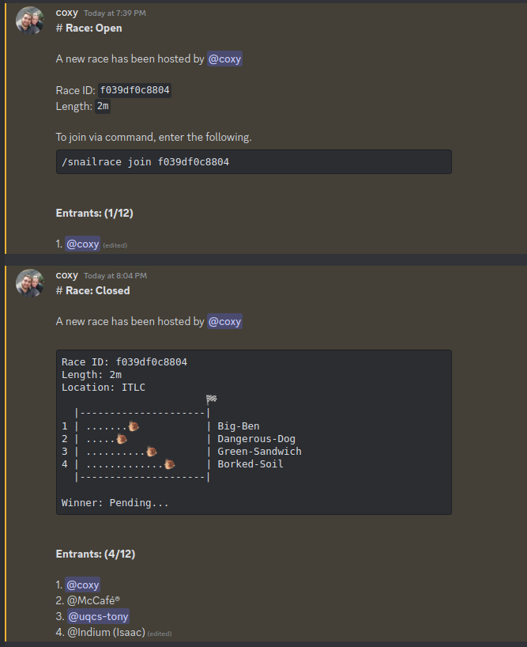

# Snailrace - Race
> 10th May 2023

The racing aspect of the game is and will always be the main gameplay feature of
the `snailrace` game. The premise of the racing mechanic is that someone will
host a race, someone will join the race then someone will win the race. I don't
want the racing to stray far from this basic system. Below is some concept 
design for how the race will look, this will be elaborated further in this 
document.



## Command

> `/snailrace race [ distance ] [ snail ] [ flags ]`

The command above is the simple initiator to start/host a race. There are a
couple of optional arguments that can be set to customise the race.

- `distance`: Set the distance of the race track, by default it is `1m` but 
              there are multiple lengths which mainly only change how long it 
              takes the racers to complete the race. `[1m | 2m | 5m | 10m]`

- `snail`: By default, your `set-snail` will race. But if you wan't one of the
           other snails from your stock, you can specify their name here and it
           will race them instead. If you choose a snail that doesn't exist, 
           then it will use your default snail instead of erroring.

- `flags`: This is a list of options/strings that act as booleans for the 
           command. By default, none of these are active. The possible values 
           are:

    - `dont-fill` To not automatically fill the race with enough racers.
    - `no-bets` Skips the betting stage.

> **Note:** Some snails are better at shorter races than longer ones, this can
>           be used for your benefit as the host with your select snail.


## Stages

The race will esentially run as a linear state machine. There are 4 states:

1. Race Open
2. Bets Open
3. Race Closed
4. Completed

Visually in discord, all the stages and graphics for the race will happen in the
same message which was the response for the host's interaction. This will 
require holding reference of the interaction response to edit. This is designed
to prevent a high volume of message spam.

### Race Open

> **Max Entrants:** 12

After runing the `/snailrace race ...` command, this will be the starting stage
and allow other members can join via the `/snailrace join <race_id>` command. 
There are some validations that need to be done in this step: The user must not 
already be in the race (regardless of snail).

The `Race Open` stage will vary in length being open for 10 seconds **after** 
the last entrant joined. ***This doesn't included failed join attempts***, which
could cause the `Race Open` stage to be open forever depending on how chaotic
the users are.

If the `dont-fill` flag **hasn't** been set. Then if there isn't a **minimum**
of **4 racers**, random users from the discord will be added to the race to fill
the space.

> **Important:** There is no minimum entrants. Which is 1 person (the host).

### Bets Open

> `no-bets` skips this stage

The bets stage will be open for a total of **30 seconds** and is open for 
everyone to make bets. A user can make multiple bets on the same or different
snails, as it will deduct money from them anyway. 

This stage must show the calculated `odds` for each snail in the race. The 
betted money will be multiplied by the odds if that snail wins. The odds are 
calculated using the following python code:

```py
def GenerateSnailOdd(snail_index: int, snails: set[SnailraceSnail]) -> float:
    # Sanity check
    if snail_index < 0 or snail_index >= len(snails):
        return 0.0
    
    # Get the snail
    snail = snails[snail_index]

    # Pre-calculate values
    sp_norm = snail.speed / sum([snail.speed for snail in snails])
    st_norm = snail.stamina / sum([snail.stamina for snail in snails])

    win_rate = 1
    if snail.wins != 0:
        win_rate = 1.0 - (snail.wins / snail.races)
        if win_rate == 0:
            return 10.0 * (1 - (sp_norm + st_norm)) 

    # Calculate odds
    return 10.0 * win_rate * (1 - (sp_norm + st_norm))
```

### Race Closed

This is the racing stage. No one can enter, no more bets can be made, it's just
pure snail racing. The race is just a loop that runs every second and calculates
the snails next steps before re-rendering the message with the new positions. 
The steps for each snail on each loop is calculated using the following:

```py
def step(self):
        # Generate Random Bias
        bias = generateMoodBias(self.mood)

        # Calculate base interval before bias and acceleration
        max_step = 10 + self.speed
        min_step = min(self.stamina, max_step - 5)
        avg_step = float(max_step + min_step) / 2.0

        # Calculate acceleration factor with weight and prevStep
        acceleration = float(self.weight - 5) / 5.0 + float(self._last_step - avg_step) / 5.0
        min_step = max(
            min_step + (-1 if self.weight < 5 else 1) * acceleration + bias, 0
        )
        max_step = min(
            max_step + (1 if self.weight < 5 else -1) * acceleration + bias, 20
        )

        # Calculate new position
        self._last_step = random.uniform(min_step, max_step)
        self._position = min(self._positionposition + self._last_step, 100)
```

### Completed

Once the 